📅 Smart Event Planning App

## Overview
**Smart Event Planning App** is a mobile application built to streamline the event planning process by enabling seamless collaboration between two primary roles: **Vendors** and **Organizers**. The platform offers a centralized, interactive space where users can connect, communicate, and coordinate effortlessly. Whether it's booking a venue, choosing a catering service, or finding the perfect decor, this app simplifies it all.

## 🚀 Features

### 1. Splash Screen
- Displays app logo and name for 3–5 seconds.

  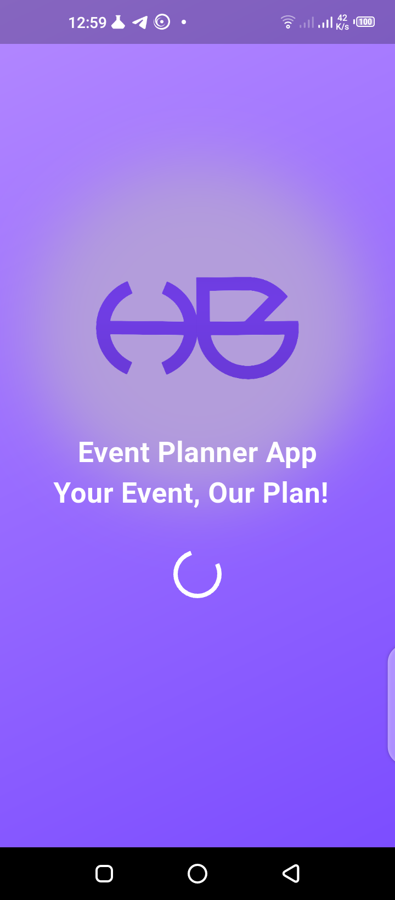
  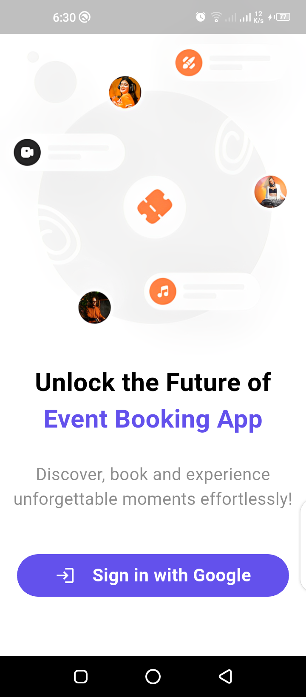

---

### 2. Authentication Flow
- Google Sign-In via Firebase Authentication.
- Persistent login using session management.
- Redirects:
    - To **Sign-Up Screen** if the user is not logged in.
    - To **Role-based Dashboard** if authenticated.

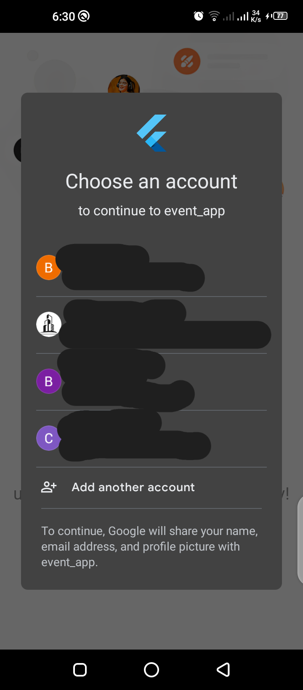

---

### 3. User Role Selection
- Users choose between **Vendor** or **Organizer** roles.
- Role-based access delivers a tailored user experience.

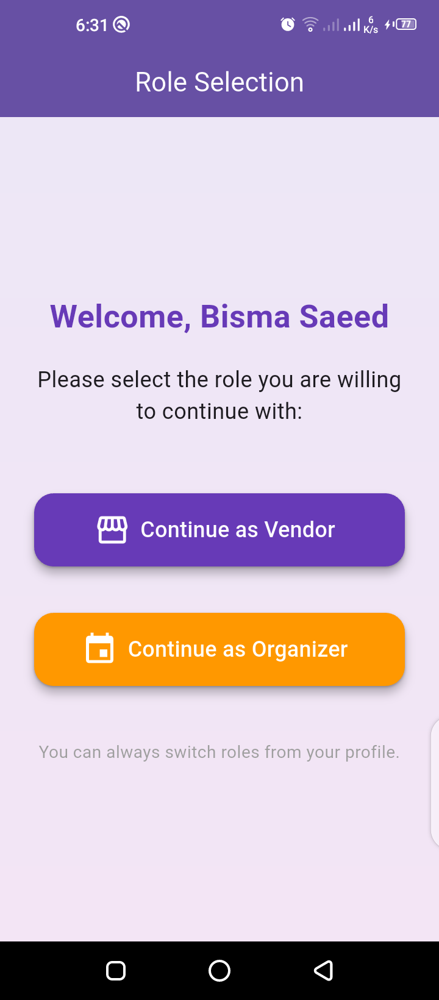

---

### 4. Vendor Dashboard
- View a list of uploaded services and upcoming booked events.

  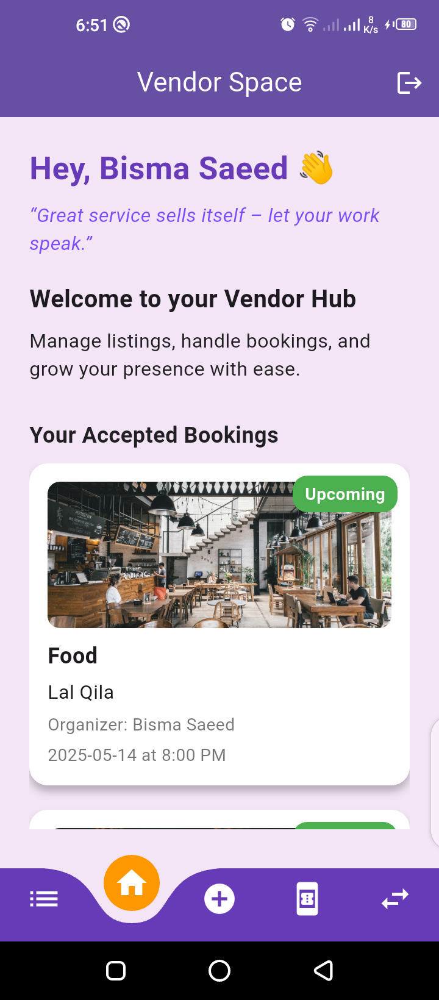
  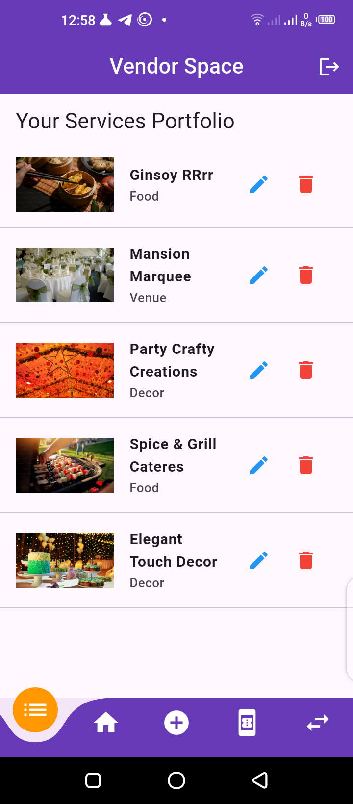

- Edit existing service posts.

- Add new services with:
    - Category selection (e.g., Food, Decor, Venue)

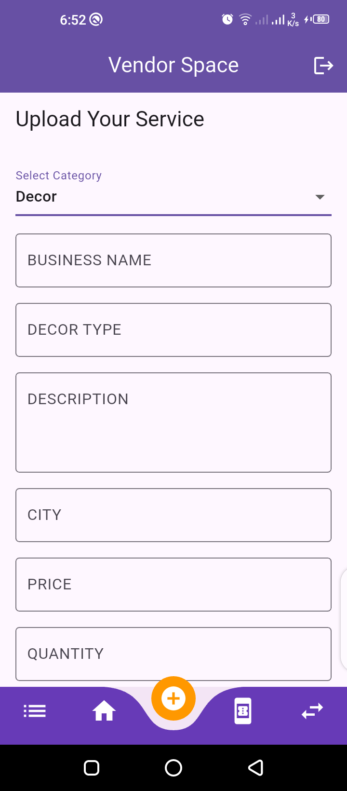

---

### 5. Booking Requests
- View incoming booking details:
    - Organizer Name, Service, Date, Status
- Accept or Reject bookings with one tap.

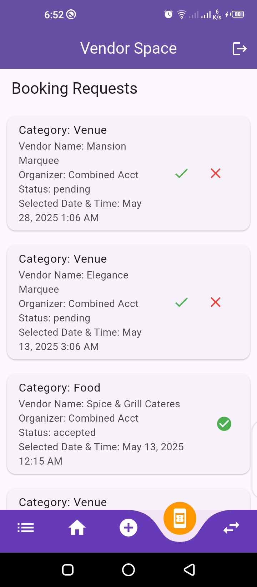

---

### 6. Organizer Dashboard
- Browse services by category: **Food**, **Decor**, **Venue**.

  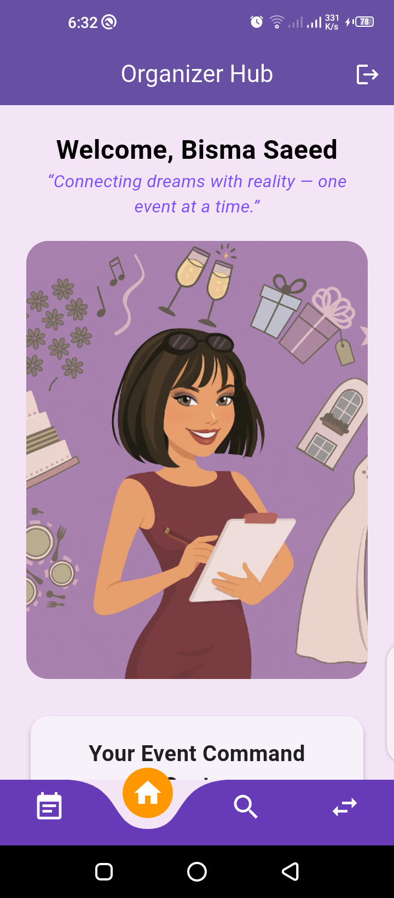
  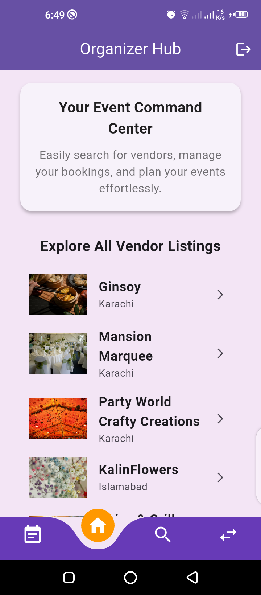

- Submit booking requests by selecting date and time.
- Users can view and post comments on services and experiences.

  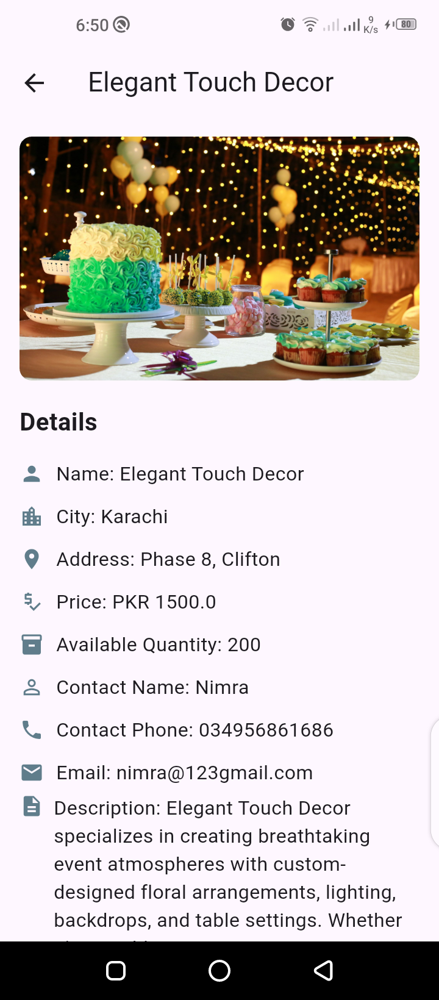
  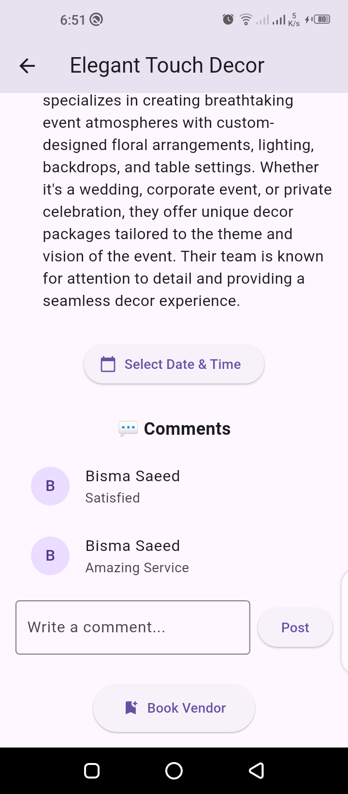

#### My Bookings
- View bookings by status: **Pending**, **Accepted**, **Rejected**.
- Option to cancel bookings.

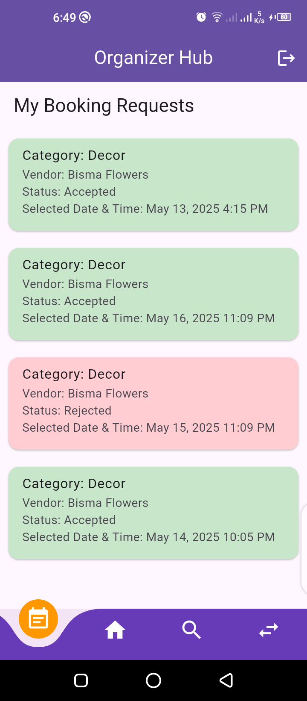

---

### 7. Search & Filtering
- Keyword search for services or vendors.
- Filter results by category for easy discovery.

  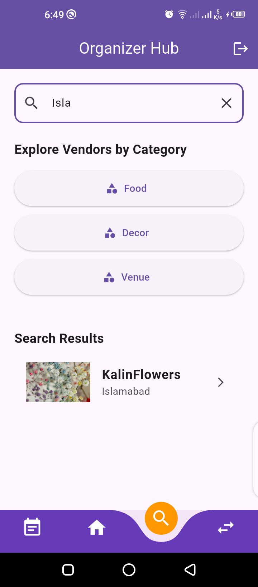
  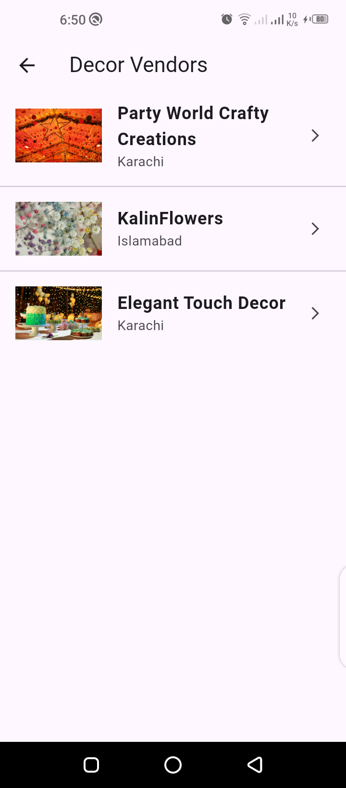

---

## Technologies Used
- **Flutter**
- **Firebase Authentication**
- **Firebase Firestore**
- **BLoC Pattern for State Management**